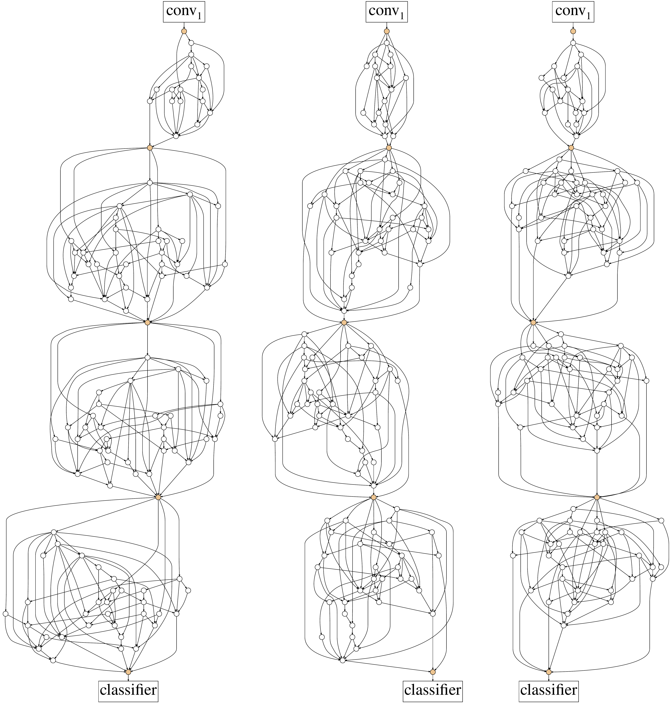
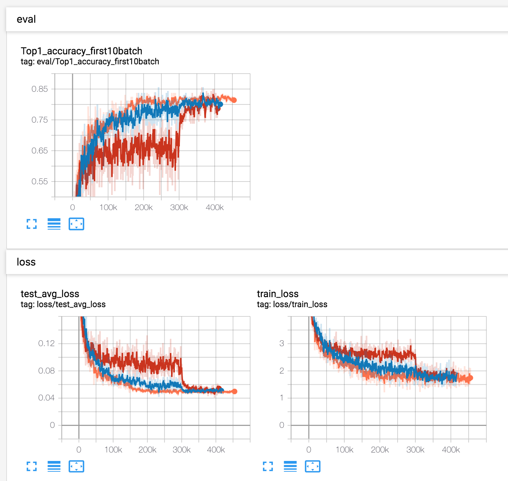

# RandWireNN

[](https://paperswithcode.com/sota/image-classification-imagenet-image-reco?p=exploring-randomly-wired-neural-networks-for)

Unofficial PyTorch Implementation of:
[Exploring Randomly Wired Neural Networks for Image Recognition](https://arxiv.org/abs/1904.01569).



## Results (To be fixed)

Caveat: These are the results evaluated before fixing issue on random-graph generation. (See [#8](https://github.com/seungwonpark/RandWireNN/issues/8)) This will be updated.

Validation result on Imagenet(ILSVRC2012) dataset:

| Top 1 accuracy (%)         | Paper | Here      |
| -------------------------- | ----- | --------- |
| RandWire-WS(4, 0.75), C=78 | 74.7  | 63.0      |


- (2019.04.14) 62.6%: 396k steps with SGD optimizer, lr 0.1, momentum 0.9, weigth decay 5e-5, lr decay about 0.1 at 300k
- (2019.04.12) 62.6%: 416k steps with Adabound optimizer, initial lr 0.001(decayed about 0.1 at 300k), final lr 0.1, no weight decay 
- [JiaminRen's implementation](https://github.com/JiaminRen/RandWireNN) reached accuarcy which is almost close to paper, using identical training strategy with paper.
- (2019.04.10) 63.0%: 450k steps with Adam optimizer, initial lr 0.001, lr decay about 0.1 for every 150k step
- (2019.04.07) 56.8%: Training took about 16 hours on AWS p3.2xlarge(NVIDIA V100). 120k steps were done in total, and Adam optimizer with `lr=0.001, batch_size=128` was used with no learning rate decay.
  
- Orange: Adam
- Blue: AdaBound
- Red: SGD

## Dependencies

This code was tested on Python 3.6 with PyTorch 1.0.1. Other packages can be installed by:
```bash
pip install -r requirements.txt
```

## Generate random DAG

```bash
cd model/graphs
python er.py -p 0.2 -o er-02.txt # Erdos-Renyi
python ba.py -m 7 -o ba-7.txt # Barbasi-Albert
python ws.py -k 4 -p 0.75 ws-4-075.txt # Watts-Strogatz
# number of nodes: -n option
```

All outputs from commands shown above will produce txt file like:
```
(number of nodes)
(number of edges)
(lines, each line representing edges)
```

## Train RandWireNN

1. Download ImageNet dataset. Train/val folder should contain list of 1,000 directories, each containing list of images for corresponding category. For validation image files, this script can be useful: https://raw.githubusercontent.com/soumith/imagenetloader.torch/master/valprep.sh
1. Edit `config.yaml`
    ```bash
    cd config
    cp default.yaml config.yaml
    vim config.yaml # specify data directory, graph txt files
    ```
1. Train

    *Note.* Validation performed here won't use entire test set, since it will consume much time. (about 3 min.)
    ```
    python trainer.py -c [config yaml] -m [name]
    ```
1. View tensorboardX
    ```
    tensorboard --logdir ./logs
    ```

## Validation

Run full validation:

```bash
python validation.py -c [config path] -p [checkpoint path]
```

This will show accuracy and average test loss of the trained model.


## Author

Seungwon Park / [@seungwonpark](http://swpark.me)

## License

Apache License 2.0
